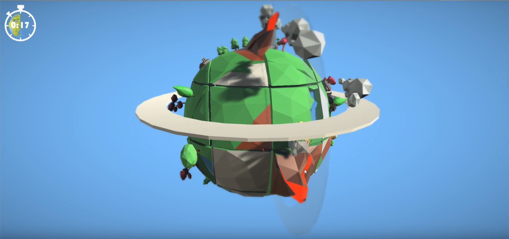

# Rubic's-World

A Game I've created for [Ludum Dare 38](https://ldjam.com/events/ludum-dare/38) in 48 hrs.

The basic Idea is, instead of standard Rubic's Cube, how about if we slice the world into pieces and the game is to solve the world by solving this rubic's Sphere/World before the tiime runs out.

The Gameplay video is shown :

